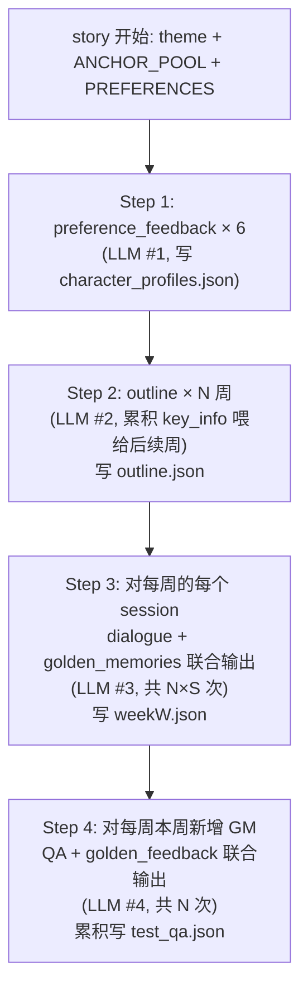

## AdaMem 数据生成流程（`prepare_data.py`，outline-first 重构后）

本文档梳理 [prepare_data.py](./prepare_data.py) 的完整数据合成流水线，特别说明每一类 LLM 调用所使用的 Prompt、依赖输入与期望输出。

> 模型与重试参数（在 [common.py](./common.py) 中常量化）：
> - `DATA_GEN_MODEL = "gemini-3.1-pro"`：本流程**所有** LLM 调用均使用该模型（统一通过 `call_gen` → `make_chat_call`）。
> - `MAX_RETRY = 10`：outline / dialogue+GM / QA+GF 解析或校验失败时的最大重试次数。
> - 所有调用都通过 OpenAI 兼容的 `OPENAI_BASE_URL` 中转，并在 `client_metadata` 中带上 `tag / story_id / week / kind="data_prep"`。
> - 角色固定 6 人（`PREFERENCES`）：`Boss Zhang / Liwei / Wanghao / Sister Chen / Mom / Jiange`。
> - 故事主题固定 10 个（`STORY_THEMES`，循环取用：`theme = STORY_THEMES[(story_id-1) % 10]`）。
> - **新增**：跨 story 共享的 `ANCHOR_POOL`（≥30 个英文短语锚点，定义于 [common.py](./common.py)）。模块导入时硬校验，缺失即 `raise`。
> - 周起始日期：`2025-07-07`，第 N 周 = `base + (N-1)*7` 起的 7 天。

---

### 0. 顶层编排（`generate_story_data`）

对单个 `story_id`，按以下 4 步顺序执行（每步内部对已有产物保持文件级幂等）：



落盘产物（与下游 [common.py L865 `load_story_bundle`](./common.py) 完全兼容）：

```
data/scaling/story_<id>/
├── character_profiles.json   # LLM #1
├── outline.json              # LLM #2 (新增产物，全 N 周大纲，单文件)
├── week<N>.json              # LLM #3 (含 messages + golden_memories)
└── test_qa.json              # LLM #4
```

幂等性：
- `character_profiles.json` 已存在且每个角色的 `preference_feedback` 非空时，跳过 LLM #1。
- `outline.json` 已存在时，跳过整段 LLM #2。
- `week<W>.json` 已存在时，跳过该周所有 session 的 LLM #3，并把已有的 `golden_memories` / `key_info` 注入到内存累积器，让后续周看到正确历史上下文。
- 老版 `week<W>_scenarios.json` **不再写出**，被 `outline.json` 取代。

失败语义：任意一类 LLM 调用在 `MAX_RETRY` 次后仍未通过结构 / 校验时，**直接 `raise`**（不再使用 1-session 兜底骨架或 `Heads up:` 占位对话），上层 `run_single_story` 捕获后通过 `update_progress` 写 `data: error: <msg>` 且不写出部分产物。

---

### 1. LLM 调用 #1：Preference Feedback（每个 story × 6 角色）

| 字段 | 值 |
| --- | --- |
| 函数 | `_generate_preference_feedback(character, preference, theme, *, story_id)` |
| 调用入口 | `_ensure_character_profiles(...)`，**前置在 outline 之前执行** |
| 触发条件 | `character_profiles.json` 中该角色的 `preference_feedback` 缺失或空 |
| 模板 | `PREFERENCE_FEEDBACK_PROMPT` |
| temperature | `0.5`，max_tokens `8192` |
| 重试 | 单次（无循环；为空时使用启发式回退句） |

#### 依赖输入

| 占位符 | 来源 |
| --- | --- |
| `character` | `PREFERENCES` 中的 key |
| `preference` | `PREFERENCES[character]["desc"]` |
| `theme` | `STORY_THEMES[(story_id-1) % 10]` |

#### 期望输出

一行口语化短句（≤25 词，第二人称，不带 markdown / 引号）。落盘：

```json
{
  "Boss Zhang": {
    "preference_id": "P1",
    "preference_desc": "only record final decisions and conclusions",
    "preference_feedback": "I'd rather you only keep the final decisions Boss Zhang makes, not every comment he tosses out."
  },
  ...
}
```

#### 失败模式

LLM 返回空字符串时，回退为 `f"I want you to focus more on {preference} when it comes to {character}."`。

---

### 2. LLM 调用 #2：Outline（每个 story × N 周）

| 字段 | 值 |
| --- | --- |
| 函数 | `_generate_one_week_outline(...)`，由 `_generate_outline_for_story(...)` 串行调度 |
| 调用入口 | Step 2，所有周生成后写 `outline.json` |
| 模板 | `OUTLINE_PROMPT` |
| temperature | 默认 `0.7`，max_tokens 默认 `8192` |
| 重试 | `MAX_RETRY=10`；最终失败 `raise RuntimeError` |

> **核心改造**：第 `w` 周的调用所看到的 `memory_context` 不再是"角色记忆尾部 5 条"，而是**第 1..w-1 周所有 session 的全部 `key_info`**，每条带 `[date] [focal_character] [anchor: A] [ref: wW_sN]` 元信息。这从根本上修复了原本"SUPERSEDES 类 session 看不到要被更新的事实"的隐性 bug。

#### 依赖输入

| 占位符 | 来源 |
| --- | --- |
| `theme` | 故事主题 |
| `week` / `total_weeks` | 当前周序号 / 总周数 |
| `weeks_remaining` | `total_weeks - week`（提示模型留出后续更新空间） |
| `date_range` | `f"{base_date} ~ {week_end}"` |
| `anchor_pool` | `ANCHOR_POOL`，每行 `- <anchor>` |
| `prev_week` | `week - 1` |
| `memory_context` | 由 `_render_memory_context_from_key_infos(accumulated_key_infos)` 渲染；`week==1` 时填 `"(week 1 -- empty memory)"` |
| `example_date` | `str(base_date)` |
| `sessions` | CLI `--sessions`（默认 10） |
| `supersedes_min` | `1 if week >= 2 else 0`，强制本周至少 1 个 SUPERSEDES |

#### 期望输出

```json
{
  "topic_anchors": ["the morning coffee chat", "the Shenzhen trip"],
  "scenarios": [
    {
      "day": "Monday",
      "date": "2025-07-07",
      "focal_character": "Boss Zhang",
      "topic_anchor": "the morning coffee chat",
      "topic": "<short scene description>",
      "characters_mentioned": ["Boss Zhang"],
      "key_info": ["On 2025-07-07 Boss Zhang approved Linchen's PTO for next Friday."],
      "noise_info": ["Someone joked the espresso machine is broken again."],
      "supersedes_key_info_ref": null
    }
  ]
}
```

每周解析时硬校验：每个 session 必须含 `focal_character ∈ PREFERENCES`、`key_info` 非空 list、`noise_info` 是 list，且总数 ≥ `max(3, sessions_per_week-2)`。

#### 全局校验（`_validate_outline`）

N 周大纲全部生成后再校验 3 条硬约束，不通过则触发**最末一周重生**（最多 `MAX_RETRY` 次）：

1. 6 个角色每个至少 1 次作为 `focal_character`；
2. 携带 `supersedes_key_info_ref` 的 session 数 ≥ `max(2, num_weeks // 3)`；
3. 跨周复用 ≥2 次的 anchor 数 ≥ `⌈3 × N / 5⌉`。

#### 落盘文件

`outline.json`：

```json
{
  "theme": "...",
  "num_weeks": 10,
  "sessions_per_week": 10,
  "weeks": [
    {
      "week": 1,
      "date_range": "2025-07-07 ~ 2025-07-13",
      "topic_anchors": ["...", "..."],
      "scenarios": [ ... ]
    }
  ]
}
```

#### 失败模式

- 单周 `MAX_RETRY` 次仍解析失败 → `raise RuntimeError`，story 标记为 `data: error: outline LLM failed`；
- 全局校验 `MAX_RETRY` 次重生仍失败 → `raise RuntimeError`，附最后一次 issues 列表。

---

### 3. LLM 调用 #3：Dialogue + Golden Memories（每个 story × N×S 次）

| 字段 | 值 |
| --- | --- |
| 函数 | `_generate_session_dialogue_with_gm(...)`，由 `_generate_week_dialogues(...)` 周内串行调度 |
| 调用入口 | Step 3，单 session 一次 LLM 调用，**dialogue 与 golden_memories 联合输出** |
| 模板 | `DIALOGUE_PROMPT` |
| temperature | 默认 `0.7`，max_tokens `8192` |
| 重试 | `MAX_RETRY=10`；最终失败 `raise RuntimeError` |

> **核心改造**：合并旧 LLM #2 (dialogue) 与 LLM #3 (post-hoc GM 抽取)，从两次调用变成一次；同时输入"截止当前 session 之前的全部 key_info + golden_memories"作为 `memory_context_so_far`，避免 dialogue 与历史事实矛盾。

#### 依赖输入

| 占位符 | 来源 |
| --- | --- |
| `theme` | 故事主题 |
| `date` / `day` / `topic` | 来自 outline 中该 session 的对应字段 |
| `focal_character` / `topic_anchor` | 同上 |
| `characters` | scenario `characters_mentioned` 用 `, ` 拼接 |
| `preference_desc` | `PREFERENCES[focal_character]["desc"]`（focal 不在白名单则直接 `raise`） |
| `memory_context_so_far` | `_render_memory_context_so_far(accumulated_key_infos, accumulated_gms)`；首 session 时为 `(this is the first session of the story)` |
| `key_info_list` | scenario `key_info` 每行 `- <item>` |
| `noise_info_list` | scenario `noise_info` 每行 `- <item>` |

#### 期望输出

```json
{
  "messages": [
    {"role": "user", "content": "..."},
    {"role": "assistant", "content": "..."}
  ],
  "golden_memories": [
    "On 2025-07-07 Boss Zhang approved Linchen's PTO request for next Friday."
  ]
}
```

校验：
- `messages` 是 list 且 ≥4 条；严格 user/assistant 交替，从 user 开始；
- `golden_memories` 是非空 list[str]，每条经空白归一化后非空。

#### 累积器更新

每完成一个 session：
- 把该 session 的 `key_info`（来自 outline）追加进 `accumulated_key_infos`；
- 把该 session 的 `golden_memories` 追加进 `accumulated_gms`。

#### 落盘文件

`week<W>.json`：

```json
{
  "week": 1,
  "conversations": [
    {
      "session_id": "w1_s1",
      "day": "Monday", "date": "2025-07-07",
      "topic": "...", "focal_character": "Boss Zhang",
      "topic_anchor": "the morning coffee chat",
      "characters_mentioned": ["Boss Zhang"],
      "messages": [...],
      "golden_memories": [...]
    }
  ]
}
```

#### 失败模式

- 单 session `MAX_RETRY` 次仍输出非法 → `raise RuntimeError`；
- focal_character 不在 `PREFERENCES` → 立即 `raise`（outline 阶段应已避免）。

---

### 4. LLM 调用 #4：QA + Golden Feedback（每个 story × N 周）

| 字段 | 值 |
| --- | --- |
| 函数 | `_generate_week_qa_with_feedback(...)` |
| 调用入口 | Step 4，每周一次，**QA 与 golden_feedback 联合输出** |
| 模板 | `QA_PROMPT` |
| temperature | `0.7`，max_tokens `8192` |
| 重试 | `MAX_RETRY=10`；最终失败 `raise RuntimeError` |

> **核心改造**：
> 1. 出题源从"跨周全局 anchor_memory_map"改为"**仅本周新增的 golden_memory**"，与 `test_week` 字段语义严格匹配；
> 2. 合并旧 LLM #4 (QA) + #5 (golden_feedback fallback)，每个 QA 在生成阶段就要求带上 `golden_feedback`；
> 3. `target_memory_refs` 在生成阶段就被强制对齐到本周真实 `(week, session_id, index)`，不满足者直接丢弃，重试不够再 `raise`；主流程**不再调用** `_backfill_target_memory_refs` 启发式反查。

#### 依赖输入

| 占位符 | 来源 |
| --- | --- |
| `week` | 当前周 |
| `qa_per_week` | CLI `--qa-per-week`（默认 10） |
| `week_memory_list` | 本周所有 GM，每行 `- <content>  [REF: week=W session=SID index=I] [focal: ...] [anchor: ...] [date: ...]` |
| `cast_preferences` | 6 个角色的 `desc` 列表 |

#### 期望输出

```json
[
  {
    "qa_type": "within_pref",
    "question": "...",
    "golden_feedback": "...",
    "gold_answer": "...",
    "target_memory": "<verbatim from week_memory_list>",
    "target_memory_refs": [{"week": 3, "session_id": "w3_s5", "index": 0}],
    "character": "...",
    "topic_anchor": "...",
    "info_category": "Decision/Conclusion|Fact/Number|Agreement/Promise|Emotion/Attitude|Schedule/Time",
    "supersedes_chain": []
  }
]
```

逐题校验：
- `question / gold_answer / golden_feedback` 三个字段必须均为非空；
- `target_memory_refs` 至少有 1 条命中本周真实 `(week, session_id, index)`，否则丢弃；
- 通过校验的 QA 数 ≥ `max(3, qa_per_week-2)` 才接受；不足则重试。

后处理：`question_id` 重写为 `f"w{week}_q{i+1}"`；累计写入 `test_qa.json`：

```json
{
  "story_id": 1,
  "total": 100,
  "test_questions": [
    {
      "test_week": 1, "question_id": "w1_q1",
      "qa_type": "within_pref",
      "character": "...", "topic_anchor": "...",
      "question": "...", "golden_feedback": "...",
      "gold_answer": "...",
      "target_memory": "...",
      "target_memory_refs": [...],
      "supersedes_chain": [],
      "info_category": "..."
    }
  ]
}
```

#### 失败模式

- `MAX_RETRY` 次仍达不到接受门槛 → `raise RuntimeError`，story 标记为 `data: error: QA+GF LLM failed`；
- 本周 GM 总数为 0（理论不应发生，因 dialogue 阶段强制非空）→ 立即 `raise`。

---

### 5. CLI 模式总览

`prepare_data.py` 提供 3 个互斥的运行模式（共用 `--stories / --weeks / --sessions / --qa-per-week / --parallel`）：

| 模式 | CLI | 行为 | 涉及 LLM 调用 |
| --- | --- | --- | --- |
| 完整生成 | `python -m AdaMem.prepare_data --stories N --weeks W --sessions S --qa-per-week Q [--parallel P]` | 每个未标记 `done` 的 story 全流程跑一遍；`--parallel>1` 时按 story 维度起子进程（每子进程内部仍然按"profiles → outline → dialogue+GM → QA+GF"严格串行） | #1 #2 #3 #4 |
| Schema 校验 | `python -m AdaMem.prepare_data --validate` | 仅做 outline / weekN.json / test_qa.json 的存在性 + 结构 + ref-integrity 检查；不发任何 LLM 请求；发现问题以非零退出码结束 | 无 |
| 旧数据回填 | `python -m AdaMem.prepare_data --backfill-golden` | **仅**对已有的旧版数据补 `golden_memories` / `golden_feedback` / `target_memory_refs`；不重生 outline / dialogue / QA。复用旧函数 `_generate_session_golden_memories` / `_generate_golden_feedback` / `_backfill_target_memory_refs` | 旧 #3 / 旧 #5（仅在缺字段时） |

幂等关键点：
1. 文件级幂等：`character_profiles.json` / `outline.json` / `week<W>.json` / `test_qa.json` 任一存在即对应步骤跳过 LLM；
2. 已存在 `week<W>.json` 时，会把其中的 `golden_memories` / `key_info` 注入内存累积器，确保后续周看到正确的"截止之前"上下文；
3. 所有调用都通过 `progress.json` 记一个 story 维度的 `data: done` 标记，已 done 的 story 在批跑里直接跳过；
4. 任意 LLM 最终失败时，`update_progress` 写 `data: error: <msg>` 且不写部分产物。

---

### 6. 调用 ↔ 落盘文件 ↔ 下游消费方

| LLM 调用 | 写入文件 | 下游运行时消费 |
| --- | --- | --- |
| #1 Preference Feedback | `character_profiles.json` 的 `preference_feedback` | `format_feedback()` 在 `verbose` fbmode 下作为偏好暗示行 |
| #2 Outline | `outline.json` | 仅 `prepare_data` 内部使用（生成 dialogue 的种子） |
| #3 Dialogue+GM | `week<N>.json` 的 `messages` + `golden_memories` | ID/FC/M0/AdaMem 每周写入对话；judge 阶段直接以 GM 做命中比对 |
| #4 QA+GF | `test_qa.json` 的 `test_questions[]` | 所有方法的周末测试源；`target_memory_refs` 喂给 `recall_judged`；`golden_feedback` 答错时拼装反馈 |

下游消费侧零变更：[common.py](./common.py) 中 `load_story_bundle` 仍按现有契约读取 `weekN.json` / `test_qa.json` / `character_profiles.json`，新流程产物字段名与旧版完全一致。`outline.json` 是新流程内部产物，运行时实验代码不读取它。

---

### 7. 失败模式与排查指引

- **outline 单周解析失败**：`MAX_RETRY` 次后 `raise`；常见原因是返回不带 `scenarios` 字段。重跑前删掉 `outline.json`。
- **outline 全局校验失败**：日志会打印 `outline validation failed (story=..., attempt=...): [issues]`；最常见是 `cross-week-reused anchors < ⌈3N/5⌉`。可手工扩充 `ANCHOR_POOL` 或调高重试。
- **dialogue+GM 单 session 失败**：tag `data_prep_dialgm_s<id>_w<W>_s<i>`；常见原因是 LLM 漏写 `golden_memories` 字段或 messages 不交替。
- **QA+GF 失败**：tag `data_prep_qagf_s<id>_w<W>`；常见原因是 LLM 编造 `target_memory_refs`、refs 不对齐本周真实 `(session_id, index)`，被全部过滤。
- **`--validate` 报 `unresolved target_memory_ref`**：通常是 `--backfill-golden` 模式下回填的旧数据中 ref 落点错位；可通过删除 `test_qa.json` 后重生该 story 修复。
- **任何 LLM 调用拿不到 200**：endpoint 不可达时整个调用链直接抛异常并把该 story 标记为 `error: ...`，不写部分产物。

---

### 8. 与旧版的不兼容点（仅供历史参考）

| 项 | 旧版 | 新版 |
| --- | --- | --- |
| 角色记忆上下文 | 每周开始用 `character_memories[char][-5:]` 重建（丢时间戳，丢中段事实） | outline 阶段用全量累积 `key_info`；dialogue 阶段用累积 `key_info + golden_memories` |
| Scenario 落盘 | `week<N>_scenarios.json`（每周一个） | `outline.json`（全 N 周一个） |
| Dialogue & GM | 两次 LLM 调用（先 dialogue，再 post-hoc GM 抽取） | 一次 LLM 调用联合输出 |
| QA & golden_feedback | 两次 LLM 调用（先 QA，再单条 GF fallback） | 一次 LLM 调用联合输出，缺一即重试 |
| target_memory_refs | LLM 回填 + 启发式 `_backfill_target_memory_refs` 兜底 | LLM 生成阶段强制对齐本周 `(session_id, index)`；主流程不再启发式回填 |
| 失败兜底 | 1-session 最小 scenario / `Heads up:` 占位 dialogue | 全部改为 `raise`，story 标记 `error` 不写产物 |

旧版 `--backfill-golden` 仍保留用于已有的预重构数据修补，不影响新流程。
